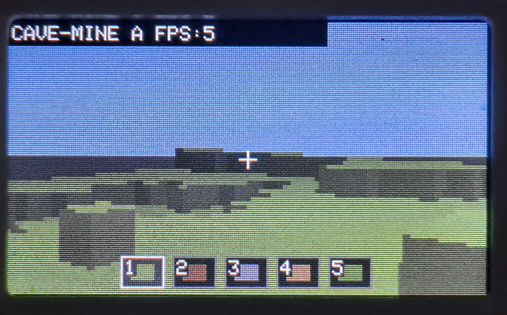
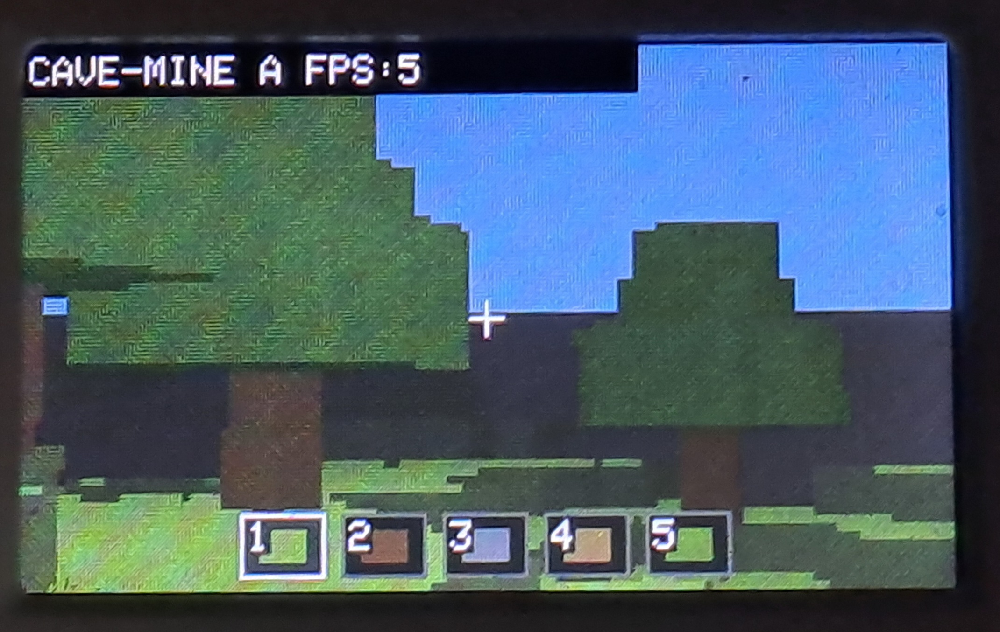

# Cave-Mine Alpha 1 for M5Stack Cardputer-Adv
 
> A true 3D Minecraft-style voxel sandbox running on the M5Stack Cardputer-Adv (ESP32-S3), built in Arduino IDE.
 

 
---
 
## What Is This?
 
**Cave-Mine Alpha 1** is a real 3D voxel sandbox designed specifically for the **M5Stack Cardputer-Adv**. It runs entirely on embedded hardware — no PC, no external GPU, no compromise.
 
This is not fake 2.5D. It is a genuine 3D voxel renderer with first-person movement, world generation, and block interaction — all running on an ESP32-S3.
 
**Features at a glance:**
- True 3D voxel DDA ray traversal
- First-person movement and jumping
- Block breaking and placing
- Perlin-style terrain generation with cave systems and trees
- Hotbar block selection
- Keyboard-based controls
 
---
 
## Demo

 

 
---
 
## Features
 
### Gameplay
- First-person movement and jumping
- Break and place blocks
- Hotbar block selection (5 slots)
 
### Rendering
- True 3D voxel DDA ray traversal
- Pinhole camera projection (no fisheye warping)
- Face shading and distance fog
- Distance-based texture simplification
- Block face highlighting
 
### World Generation
- Perlin / fBM terrain heightmap
- 3D cave carving
- Tree generation
 
### Block Types
- Grass
- Dirt
- Stone
- Oak Log (with end-grain)
- Leaves
 
---
 
## Controls
 
| Action | Key |
|---|---|
| Move forward | `E` |
| Move backward | `S` |
| Strafe left | `A` |
| Strafe right | `D` |
| Jump | `Space` |
| Look up | `;` |
| Look down | `.` |
| Yaw left | `,` |
| Yaw right | `/` |
| Break block | `X` |
| Place block | `C` |
| Select hotbar slot | `1` – `5` |
 
---
 
## Quick Start
 
### Option 1 — Flash the Binary
 
Download the prebuilt binary: **`cave-mine-cardputer-alpha1.bin`**
 
Flash it using any of the following:
- [Spacehuhn ESP Web Flasher](https://esptool.spacehuhn.com/)
- M5Stack Cardputer launcher

---
 
### Option 2 — Build from Source
 
**Requirements:**
- Arduino IDE
- M5Stack board package
- M5Cardputer library
 
**Steps:**
1. Open `cave-mine-cardputer-alpha1.ino` in Arduino IDE
2. Select board: **M5Cardputer**
3. Compile and upload
 
---
 
## Hardware Target
 
| | |
|---|---|
| **Device** | M5Stack Cardputer-Adv |
| **MCU** | ESP32-S3 |
| **Display** | Built-in |
| **Input** | Built-in keyboard |
 
---
 
## Project Status
 
This is an **alpha release**. The game is playable but still early-stage.
 
Active development is currently paused — contributions are very welcome. See [Contributing](#contributing) for details.
 
---
 
## Contributing
 
Contributions are open and encouraged. Areas where help would be most valuable:
 
- Performance optimization
- Better terrain and cave generation
- Save / load via SD card
- Lighting system
- Water, sand, biomes
- Chunk streaming
- Inventory system
- UI improvements
- Sound effects
- Code cleanup and refactoring
 
**Please keep contributions:**
- Arduino IDE compatible
- Focused on the Cardputer hardware
- Efficient for embedded constraints
 
---
 
## Known Limitations
 
- No save / load
- No chunk streaming
- No lighting system
- No sound
- Leaves are basic placeholder geometry
- Limited world size
- Performance may drop in dense scenes
 
---
 
## Roadmap Ideas
 
- SD card save / load
- Improved cave generation
- Lighting system
- Water, sand, biomes
- Chunk system
- Inventory system
- UI improvements
- Sound effects
 
---
 
## License
 
This project is licensed under the **MIT License**. See [LICENSE](LICENSE) for details.
 
---
 
## Credits
 
- Inspired by **Minecraft Alpha**
- Built for the **M5Stack Cardputer-Adv**
- Developed in **Arduino IDE**
- Powered by **ESP32-S3**
 
